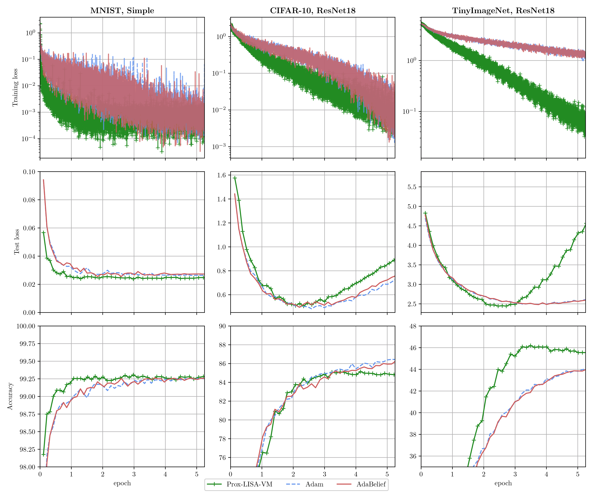

# A variable metric proximal stochastic gradient method: an application to classification problems

# Abstract
Due to the continued success of machine learning and deep learning in particular, supervised classification problems are ubiquitous in numerous scientific fields.
Training these models typically involves the minimization of the empirical risk over large data sets along with a possibly non-differentiable regularization.
In this paper, we introduce a stochastic gradient method for the considered classification problem.
To control the variance of the objective's gradients, we use an automatic sample size selection along with a variable metric to precondition the stochastic gradient directions.
Further, we utilize a non-monotone line search to automatize step size selection.
Convergence results are provided for both convex and non-convex objective functions.
Extensive numerical experiments verify that the suggested approach performs on par with state-of-the-art methods for training both statistical models for binary classification and artificial neural networks for multi-class image classification.

## Non-convex multi-class classification
<p align="center">

</p>

# Credits
- **dataset_TinyImageNet.py** contains the auxiliary functions to load the dataset. It's a modified version of [this loader](https://github.com/pranavphoenix/TinyImageNetLoader/blob/main/tinyimagenetloader.py). 
- **Adabelief.py** contains the implementation of the AdaBelief optimizer available [here](https://github.com/juntang-zhuang/Adabelief-Optimizer).
- **adam.py** contains an implementation of the Adam optimizer in PyTorch .

## How to download Tiny ImageNet 
[Dataset on Paperswithcode](https://paperswithcode.com/dataset/tiny-imagenet)
```
mkdir data && cd data
wget http://cs231n.stanford.edu/tiny-imagenet-200.zip
unzip -q tiny-imagenet-200.zip
```

# Citing
Please consider to cite this work if you find it helpful.

```BibTex
@article{cascarano2024variable,
  title={A variable metric proximal stochastic gradient method: an application to classification problems},
  author={Cascarano, Pasquale and Franchini, Giorgia and Kobler, Erich and Porta, Federica and Sebastiani, Andrea},
  journal={EURO Journal on Computational Optimization},
  volume={},
  pages={},
  year={2024},
  publisher={Elsevier}
}

```
